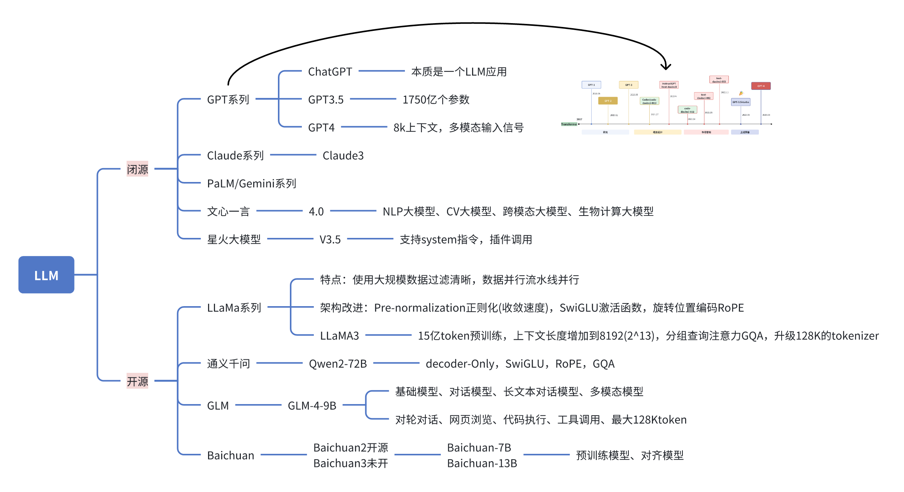

# 1.大型语言模型 LLM 介绍

LLM：Large Language Model，大语言模型

PLM：Pre-trained Language Model，大规模预训练语言模型

ICL：In-Context Learning，上下文学习

Emergent Abilities，涌现能力

GPT：Generative Pre-Training，生成式与训练语言模型，decoder-only

RoPE，Rotary Position Embedding，旋转位置编码，LLaMA

RAG，retrieval augmented generation，检索增强生成

第一次学习怎样使用github,qwq做的不好请见谅
