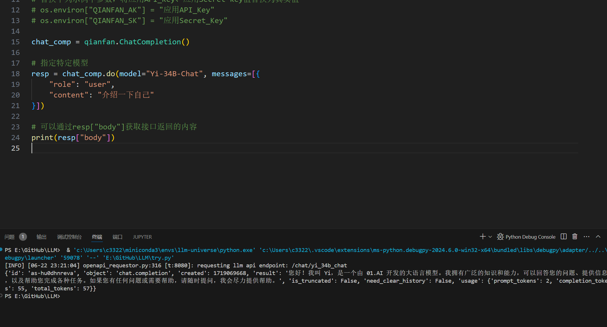

# 使用 LLM API 开发

> ### 目录
	[toc]

## 一、使用文心一言

#### 

## 二、Prompt 设计的原则及使用技巧

#### 2.1 编写清晰、具体的指令
+ Prompt 需要清晰明确地表达需求，提供充足上下文，使语言模型能够准确理解我们的意图
+ 使用分隔符清晰的划分各部分 
  + 分隔符就像是 Prompt 中的墙，将不同的指令、上下文、输入隔开，避免意外的混淆
+ 不使用分隔符需要防止提示词注入
  + 提示词注入即： **用户输入的文本可能包含与你的预设 Prompt 相冲突的内容**
+ 寻求结构化输出
  + 结构清晰更加利于解析处理
+ 要求模型检查是否满足条件
  + 好比 `if ... else ...`避免意外情况或者错误发生
+ 提供少量示例
  +  *Few-shot" prompting（少样本提示）*，即在要求模型执行实际任务之前，给模型提供一两个参考样例，让模型了解我们的要求和期望的输出样式。

#### 2.2 给模型时间去思考

+ 在指定完成任务所需要的步骤
  + 使模型完成任务的逻辑更加清晰

+ 指导模型在下结论前找出自己的解法
  + 锻炼模型自己解决问题的能力，而不是轻易被引导至错误的结果

> [!WARNING]
>
> 在开发与应用语言模型时，需要注意它们可能生成虚假信息的风险。尽管模型经过大规模预训练，掌握了丰富知识，但它实际上并没有完全记住所见的信息，难以准确判断自己的知识边界，可能做出错误推断。若让语言模型描述一个不存在的产品,它可能会自行构造出似是而非的细节。这被称为`“幻觉”(Hallucination)`，是语言模型的一大缺陷。

