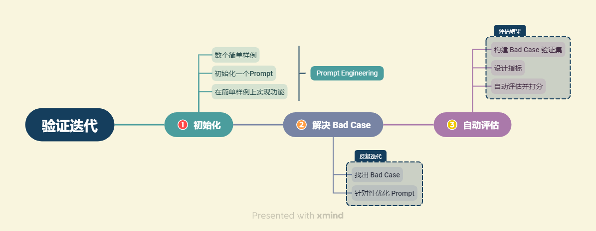

# 系统评估与优化

> [toc]



## 一、大模型评估方法

在具体的大模型应用开发中，我们可以找到 Bad Cases，并不断针对性优化 Prompt 或检索架构来解决 Bad Cases，从而优化系统的表现。我们会将找到的每一个 Bad Case 都加入到我们的验证集中，每一次优化之后，我们会重新对验证集中所有验证案例进行验证，从而保证优化后的 系统不会在原有 Good Case 上失去能力或表现降级。当验证集体量较小时，我们可以采用人工评估的方法，即对验证集中的每一个验证案例，人工评估系统输出的优劣；但是，当验证集随着系统的优化而不断扩张，其体量会不断增大，以至于人工评估的时间和人力成本扩大到我们无法接受的程度。因此，我们需要采用自动评估的方法，自动评估系统对每一个验证案例的输出质量，从而评估系统的整体性能。

我们将首先介绍人工评估的一般思路以供参考，接着深入介绍大模型自动评估的一般方法，并在本系统上进行实际验证，全面评估本系统表现，为系统的进一步优化迭代做准备。同样，在正式开始之前，我们先加载我们的向量数据库与检索链：

```python
import sys
sys.path.append("../C3 搭建知识库") # 将父目录放入系统路径中

# 使用智谱 Embedding API，注意，需要将上一章实现的封装代码下载到本地
from zhipuai_embedding import ZhipuAIEmbeddings

from langchain.vectorstores.chroma import Chroma
from langchain_openai import ChatOpenAI
from dotenv import load_dotenv, find_dotenv
import os

_ = load_dotenv(find_dotenv())    # read local .env file
zhipuai_api_key = os.environ['ZHIPUAI_API_KEY']
OPENAI_API_KEY = os.environ["OPENAI_API_KEY"]

# 定义 Embeddings
embedding = ZhipuAIEmbeddings()

# 向量数据库持久化路径
persist_directory = '../../data_base/vector_db/chroma'

# 加载数据库
vectordb = Chroma(
    persist_directory=persist_directory,  # 允许我们将persist_directory目录保存到磁盘上
    embedding_function=embedding
)

# 使用 OpenAI GPT-3.5 模型
llm = ChatOpenAI(model_name = "gpt-3.5-turbo", temperature = 0)
```

### 1. 人工评估的一般思路

在系统开发的初期，验证集体量较小，最简单、直观的方法即为人工对验证集中的每一个验证案例进行评估。但是，人工评估也有一些基本准则与思路，此处简要介绍供学习者参考。但请注意，系统的评估与业务强相关，设计具体的评估方法与维度需要结合具体业务深入考虑。

+ **准则一：量化评估**

  为保证很好地比较不同版本的系统性能，量化评估指标是非常必要的。我们应该对每一个验证案例的回答都给出打分，最后计算所有验证案例的平均分得到本版本系统的得分。量化的量纲可以根据个人风格和业务实际情况而定。

  量化后的评估指标应当有一定的评估规范，例如在满足条件 A 的情况下可以打分为 y 分，以保证不同评估员之间评估的相对一致。

  如果我们不量化评估指标，仅使用相对优劣的评估的话，我们无法判断 A 与 B 哪一个 prompt 更好，从而要找到一个 prompt 在所有案例上表现都更优才能进一步迭代；然而，这很明显是非常困难且不利于我们迭代优化的。

+ **准则二：多维评估**

  大模型是典型的生成模型，即其回答为一个由模型生成的语句。一般而言，大模型的回答需要在多个维度上进行评估。例如，本项目的个人知识库问答项目上，用户提问一般是针对个人知识库的内容进行提问，模型的回答需要同时满足充分使用个人知识库内容、答案与问题一致、答案真实有效、回答语句通顺等。一个优秀的问答助手，应当既能够很好地回答用户的问题，保证答案的正确性，又能够体现出充分的智能性。

  因此，我们往往需要从多个维度出发，设计每个维度的评估指标，在每个维度上都进行打分，从而综合评估系统性能。同时需要注意的是，多维评估应当和量化评估有效结合，对每一个维度，可以设置相同的量纲也可以设置不同的量纲，应充分结合业务实际。

  **例如，在本项目中，我们可以设计如下几个维度的评估：**

  ① 知识查找正确性。该维度需要查看系统从向量数据库查找相关知识片段的中间结果，评估系统查找到的知识片段是否能够对问题做出回答。该维度为0-1评估，即打分为0指查找到的知识片段不能做出回答，打分为1指查找到的知识片段可以做出回答。

  ② 回答一致性。该维度评估系统的回答是否针对用户问题展开，是否有偏题、错误理解题意的情况，该维度量纲同样设计为0~1，0为完全偏题，1为完全切题，中间结果可以任取。

  ③ 回答幻觉比例。该维度需要综合系统回答与查找到的知识片段，评估系统的回答是否出现幻觉，幻觉比例有多高。该维度同样设计为0~1,0为全部是模型幻觉，1为没有任何幻觉。

  ④ 回答正确性。该维度评估系统回答是否正确，是否充分解答了用户问题，是系统最核心的评估指标之一。该维度可以在0~1之间任意打分。

  上述四个维度都围绕知识、回答的正确性展开，与问题高度相关；接下来几个维度将围绕大模型生成结果的拟人性、语法正确性展开，与问题相关性较小：

  ⑤ 逻辑性。该维度评估系统回答是否逻辑连贯，是否出现前后冲突、逻辑混乱的情况。该维度为0-1评估。

  ⑥ 通顺性。该维度评估系统回答是否通顺、合乎语法，可以在0~1之间任意打分。

  ⑦ 智能性。该维度评估系统回答是否拟人化、智能化，是否能充分让用户混淆人工回答与智能回答。该维度可以在0~1之间任意打分。

### 2. 简单自动评估

大模型评估之所以复杂，一个重要原因在于生成模型的答案很难判别，即客观题评估判别很简单，主观题评估判别则很困难。尤其是对于一些没有标准答案的问题，实现自动评估就显得难度尤大。但是，在牺牲一定评估准确性的情况下，我们可以将复杂的没有标准答案的主观题进行转化，从而变成有标准答案的问题，进而通过简单的自动评估来实现。此处介绍两种方法：构造客观题与计算标准答案相似度。

+ **方法一：构建客观题**

  主观题的评估是非常困难的，但是客观题可以直接对比系统答案与标准答案是否一致，从而实现简单评估。我们可以将部分主观题构造为多项或单项选择的客观题，进而实现简单评估。例如，对于问题：

  ```markup
  【问答题】南瓜书的作者是谁？Copy to clipboardErrorCopied
  ```

  我们可以将该主观题构造为如下客观题：

  ```markup
  【多项选择题】南瓜书的作者是谁？   A 周志明 B 谢文睿 C 秦州 D 贾彬彬Copy to clipboardErrorCopied
  ```

  要求模型回答该客观题，我们给定标准答案为 BCD，将模型给出答案与标准答案对比即可实现评估打分。根据以上思想，我们可以构造出一个 Prompt 问题模板：

  ```python
  def multi_select_score_v1(true_answer : str, generate_answer : str) -> float:
      # true_anser : 正确答案，str 类型，例如 'BCD'
      # generate_answer : 模型生成答案，str 类型
      true_answers = list(true_answer)
      '''为便于计算，我们假设每道题都只有 A B C D 四个选项'''
      # 先找出错误答案集合
      false_answers = [item for item in ['A', 'B', 'C', 'D'] if item not in true_answers]
      # 如果生成答案出现了错误答案
      for one_answer in false_answers:
          if one_answer in generate_answer:
              return 0
      # 再判断是否全选了正确答案
      if_correct = 0
      for one_answer in true_answers:
          if one_answer in generate_answer:
              if_correct += 1
              continue
      if if_correct == 0:
          # 不选
          return 0
      elif if_correct == len(true_answers):
          # 全选
          return 1
      else:
          # 漏选
          return 0.5Copy to clipboardErrorCopied
  ```

  基于上述打分函数，我们可以测试四个回答：

  ① B C

  ② 除了 A 周志华之外，其他都是南瓜书的作者

  ③ 应该选择 B C D

  ④ 我不知道

  ```python
  answer1 = 'B C'
  answer2 = '西瓜书的作者是 A 周志华'
  answer3 = '应该选择 B C D'
  answer4 = '我不知道'
  true_answer = 'BCD'
  print("答案一得分：", multi_select_score_v1(true_answer, answer1))
  print("答案二得分：", multi_select_score_v1(true_answer, answer2))
  print("答案三得分：", multi_select_score_v1(true_answer, answer3))
  print("答案四得分：", multi_select_score_v1(true_answer, answer4))Copy to clipboardErrorCopied
  答案一得分： 0.5
  答案二得分： 0
  答案三得分： 1
  答案四得分： 0Copy to clipboardErrorCopied
  ```

  但是我们可以看到，我们要求模型在不能回答的情况下不做选择，而不是随便选。但是在我们的打分策略中，错选和不选均为0分，这样其实鼓励了模型的幻觉回答，因此我们可以根据情况调整打分策略，让错选扣一分：

  ```python
  def multi_select_score_v2(true_answer : str, generate_answer : str) -> float:
      # true_anser : 正确答案，str 类型，例如 'BCD'
      # generate_answer : 模型生成答案，str 类型
      true_answers = list(true_answer)
      '''为便于计算，我们假设每道题都只有 A B C D 四个选项'''
      # 先找出错误答案集合
      false_answers = [item for item in ['A', 'B', 'C', 'D'] if item not in true_answers]
      # 如果生成答案出现了错误答案
      for one_answer in false_answers:
          if one_answer in generate_answer:
              return -1
      # 再判断是否全选了正确答案
      if_correct = 0
      for one_answer in true_answers:
          if one_answer in generate_answer:
              if_correct += 1
              continue
      if if_correct == 0:
          # 不选
          return 0
      elif if_correct == len(true_answers):
          # 全选
          return 1
      else:
          # 漏选
          return 0.5Copy to clipboardErrorCopied
  ```

  如上，我们使用第二版本的打分函数再次对四个答案打分：

  ```python
  answer1 = 'B C'
  answer2 = '西瓜书的作者是 A 周志华'
  answer3 = '应该选择 B C D'
  answer4 = '我不知道'
  true_answer = 'BCD'
  print("答案一得分：", multi_select_score_v2(true_answer, answer1))
  print("答案二得分：", multi_select_score_v2(true_answer, answer2))
  print("答案三得分：", multi_select_score_v2(true_answer, answer3))
  print("答案四得分：", multi_select_score_v2(true_answer, answer4))Copy to clipboardErrorCopied
  答案一得分： 0.5
  答案二得分： -1
  答案三得分： 1
  答案四得分： 0Copy to clipboardErrorCopied
  ```

  可以看到，这样我们就实现了快速、自动又有区分度的自动评估。在这样的方法下，我们只需对每一个验证案例进行构造，之后每一次验证、迭代都可以完全自动化进行，从而实现了高效的验证。

  但是，不是所有的案例都可以构造为客观题，针对一些不能构造为客观题或构造为客观题会导致题目难度骤降的情况，我们需要用到第二种方法：计算答案相似度。

  

+ **方法二：计算答案相似度**

  生成问题的答案评估在 NLP 中实则也不是一个新问题了，不管是机器翻译、自动文摘等任务，其实都需要评估生成答案的质量。NLP 一般对生成问题采用人工构造标准答案并计算回答与标准答案相似度的方法来实现自动评估。

  例如，对问题：

  ```markup
  南瓜书的目标是什么？Copy to clipboardErrorCopied
  ```

  我们可以首先人工构造一个标准回答：

  ```markup
  周志华老师的《机器学习》（西瓜书）是机器学习领域的经典入门教材之一，周老师为了使尽可能多的读者通过西瓜书对机器学习有所了解, 所以在书中对部分公式的推导细节没有详述，但是这对那些想深究公式推导细节的读者来说可能“不太友好”，本书旨在对西瓜书里比较难理解的公式加以解析，以及对部分公式补充具体的推导细节。Copy to clipboardErrorCopied
  ```

  接着对模型回答计算其与该标准回答的相似程度，越相似则我们认为答案正确程度越高。

  计算相似度的方法有很多，我们一般可以使用 BLEU 来计算相似度，其原理详见：[知乎|BLEU详解](https://zhuanlan.zhihu.com/p/223048748)，对于不想深究算法原理的同学，可以简单理解为主题相似度。

  我们可以调用 nltk 库中的 bleu 打分函数来计算：

  ```python
  from nltk.translate.bleu_score import sentence_bleu
  import jieba
  
  def bleu_score(true_answer : str, generate_answer : str) -> float:
      # true_anser : 标准答案，str 类型
      # generate_answer : 模型生成答案，str 类型
      true_answers = list(jieba.cut(true_answer))
      # print(true_answers)
      generate_answers = list(jieba.cut(generate_answer))
      # print(generate_answers)
      bleu_score = sentence_bleu(true_answers, generate_answers)
      return bleu_scoreCopy to clipboardErrorCopied
  ```

  测试一下：

  ```python
  true_answer = '周志华老师的《机器学习》（西瓜书）是机器学习领域的经典入门教材之一，周老师为了使尽可能多的读者通过西瓜书对机器学习有所了解, 所以在书中对部分公式的推导细节没有详述，但是这对那些想深究公式推导细节的读者来说可能“不太友好”，本书旨在对西瓜书里比较难理解的公式加以解析，以及对部分公式补充具体的推导细节。'
  
  print("答案一：")
  answer1 = '周志华老师的《机器学习》（西瓜书）是机器学习领域的经典入门教材之一，周老师为了使尽可能多的读者通过西瓜书对机器学习有所了解, 所以在书中对部分公式的推导细节没有详述，但是这对那些想深究公式推导细节的读者来说可能“不太友好”，本书旨在对西瓜书里比较难理解的公式加以解析，以及对部分公式补充具体的推导细节。'
  print(answer1)
  score = bleu_score(true_answer, answer1)
  print("得分：", score)
  print("答案二：")
  answer2 = '本南瓜书只能算是我等数学渣渣在自学的时候记下来的笔记，希望能够帮助大家都成为一名合格的“理工科数学基础扎实点的大二下学生”'
  print(answer2)
  score = bleu_score(true_answer, answer2)
  print("得分：", score)Copy to clipboardErrorCopied
  答案一：
  周志华老师的《机器学习》（西瓜书）是机器学习领域的经典入门教材之一，周老师为了使尽可能多的读者通过西瓜书对机器学习有所了解, 所以在书中对部分公式的推导细节没有详述，但是这对那些想深究公式推导细节的读者来说可能“不太友好”，本书旨在对西瓜书里比较难理解的公式加以解析，以及对部分公式补充具体的推导细节。
  得分： 1.2705543769116016e-231
  答案二：
  本南瓜书只能算是我等数学渣渣在自学的时候记下来的笔记，希望能够帮助大家都成为一名合格的“理工科数学基础扎实点的大二下学生”
  得分： 1.1935398790363042e-231Copy to clipboardErrorCopied
  ```

  可以看到，答案与标准答案一致性越高，则评估打分就越高。通过此种方法，我们同样只需对验证集中每一个问题构造一个标准答案，之后就可以实现自动、高效的评估。

  但是，该种方法同样存在几个问题：① 需要人工构造标准答案。对于一些垂直领域而言，构造标准答案可能是一件困难的事情；② 通过相似度来评估，可能存在问题。例如，如果生成回答与标准答案高度一致但在核心的几个地方恰恰相反导致答案完全错误，bleu 得分仍然会很高；③ 通过计算与标准答案一致性灵活性很差，如果模型生成了比标准答案更好的回答，但评估得分反而会降低；④ 无法评估回答的智能性、流畅性。如果回答是各个标准答案中的关键词拼接出来的，我们认为这样的回答是不可用无法理解的，但 bleu 得分会较高。

  因此，针对业务情况，有时我们还需要一些不需要构造标准答案的、进阶的评估方法。

## 二、评估并优化生成部分

### 1. 提升直观回答质量

寻找 Bad Case 的思路有很多，最直观也最简单的就是评估直观回答的质量，结合原有资料内容，判断在什么方面有所不足。例如，上述的测试我们可以构造成一个 Bad Case：

```markup
问题：什么是南瓜书
初始回答：南瓜书是对《机器学习》（西瓜书）中难以理解的公式进行解析和补充推导细节的一本书。谢谢你的提问！
存在不足：回答太简略，需要回答更具体；谢谢你的提问感觉比较死板，可以去掉Copy to clipboardErrorCopied
```

### 2. 表明知识来源，提高可信度

由于大模型存在幻觉问题，有时我们会怀疑模型回答并非源于已有知识库内容，这对一些需要保证真实性的场景来说尤为重要

我们可以要求模型在生成回答时注明知识来源，这样可以避免模型杜撰并不存在于给定资料的知识，同时，也可以提高我们对模型生成答案的可信度

但是，附上原文来源往往会导致上下文的增加以及回复速度的降低，我们需要根据业务场景酌情考虑是否要求附上原文。

### 3. 构造思维链

大模型往往可以很好地理解并执行指令，但模型本身还存在一些能力的限制，例如大模型的幻觉、无法理解较为复杂的指令、无法执行复杂步骤等。我们可以通过构造思维链，将 Prompt 构造成一系列步骤来尽量减少其能力限制，例如，我们可以构造一个两步的思维链，要求模型在第二步做出反思，以尽可能消除大模型的幻觉问题。

### 4. 增加一个指令解析

我们往往会面临一个需求，即我们需要模型以我们指定的格式进行输出。但是，由于我们使用了 Prompt Template 来填充用户问题，用户问题中存在的格式要求往往会被忽略，例如：

```python
question = "LLM的分类是什么？给我返回一个 Python List"
result = qa_chain({"query": question})
print(result["result"])Copy to clipboardErrorCopied
根据上下文提供的信息，LLM（Large Language Model）的分类可以分为两种类型，即基础LLM和指令微调LLM。基础LLM是基于文本训练数据，训练出预测下一个单词能力的模型，通常通过在大量数据上训练来确定最可能的词。指令微调LLM则是对基础LLM进行微调，以更好地适应特定任务或场景，类似于向另一个人提供指令来完成任务。

根据上下文，可以返回一个Python List，其中包含LLM的两种分类：["基础LLM", "指令微调LLM"]。Copy to clipboardErrorCopied
```

可以看到，虽然我们要求模型给返回一个 Python List，但该输出要求被包裹在 Template 中被模型忽略掉了。针对该问题，我们可以构造一个 Bad Case：

```markup
问题：LLM的分类是什么？给我返回一个 Python List
初始回答：根据提供的上下文，LLM的分类可以分为基础LLM和指令微调LLM。
存在不足：没有按照指令中的要求输出Copy to clipboardErrorCopied
```

针对该问题，一个存在的解决方案是，在我们的检索 LLM 之前，增加一层 LLM 来实现指令的解析，将用户问题的格式要求和问题内容拆分开来。这样的思路其实就是目前大火的 Agent 机制的雏形，即针对用户指令，设置一个 LLM（即 Agent）来理解指令，判断指令需要执行什么工具，再针对性调用需要执行的工具，其中每一个工具可以是基于不同 Prompt Engineering 的 LLM，也可以是例如数据库、API 等。LangChain 中其实有设计 Agent 机制，但本教程中我们就不再赘述了，这里只基于 OpenAI 的原生接口简单实现这一功能：

```python
# 使用第二章讲过的 OpenAI 原生接口

from openai import OpenAI

client = OpenAI(
    # This is the default and can be omitted
    api_key=os.environ.get("OPENAI_API_KEY"),
)


def gen_gpt_messages(prompt):
    '''
    构造 GPT 模型请求参数 messages
    
    请求参数：
        prompt: 对应的用户提示词
    '''
    messages = [{"role": "user", "content": prompt}]
    return messages


def get_completion(prompt, model="gpt-3.5-turbo", temperature = 0):
    '''
    获取 GPT 模型调用结果

    请求参数：
        prompt: 对应的提示词
        model: 调用的模型，默认为 gpt-3.5-turbo，也可以按需选择 gpt-4 等其他模型
        temperature: 模型输出的温度系数，控制输出的随机程度，取值范围是 0~2。温度系数越低，输出内容越一致。
    '''
    response = client.chat.completions.create(
        model=model,
        messages=gen_gpt_messages(prompt),
        temperature=temperature,
    )
    if len(response.choices) > 0:
        return response.choices[0].message.content
    return "generate answer error"

prompt_input = '''
请判断以下问题中是否包含对输出的格式要求，并按以下要求输出：
请返回给我一个可解析的Python列表，列表第一个元素是对输出的格式要求，应该是一个指令；第二个元素是去掉格式要求的问题原文
如果没有格式要求，请将第一个元素置为空
需要判断的问题：
~~~
{}
~~~
不要输出任何其他内容或格式，确保返回结果可解析。
'''

Copy to clipboardErrorCopied
```

我们测试一下该 LLM 分解格式要求的能力：

```python
response = get_completion(prompt_input.format(question))
responseCopy to clipboardErrorCopied
'```\n["给我返回一个 Python List", "LLM的分类是什么？"]\n```'Copy to clipboardErrorCopied
```

可以看到，通过上述 Prompt，LLM 可以很好地实现输出格式的解析，接下来，我们可以再设置一个 LLM 根据输出格式要求，对输出内容进行解析：

```python
prompt_output = '''
请根据回答文本和输出格式要求，按照给定的格式要求对问题做出回答
需要回答的问题：
~~~
{}
~~~
回答文本：
~~~
{}
~~~
输出格式要求：
~~~
{}
~~~
'''Copy to clipboardErrorCopied
```

然后我们可以将两个 LLM 与检索链串联起来：

```python
question = 'LLM的分类是什么？给我返回一个 Python List'
# 首先将格式要求与问题拆分
input_lst_s = get_completion(prompt_input.format(question))
# 找到拆分之后列表的起始和结束字符
start_loc = input_lst_s.find('[')
end_loc = input_lst_s.find(']')
rule, new_question = eval(input_lst_s[start_loc:end_loc+1])
# 接着使用拆分后的问题调用检索链
result = qa_chain({"query": new_question})
result_context = result["result"]
# 接着调用输出格式解析
response = get_completion(prompt_output.format(new_question, result_context, rule))
responseCopy to clipboardErrorCopied
"['基础LLM', '指令微调LLM']"Copy to clipboardErrorCopied
```

可以看到，经过如上步骤，我们就成功地实现了输出格式的限定
